# Hackathon Tasks & Coordination Hub

This is the central task tracking document for the 8-hour hackathon. It organizes features into chronological milestones and coordinates tasks among team members based on their specific roles.

---

## 1. Team Roles & Direct Links

Every team member has an isolated task list. Click on your name below to view your dedicated development board:

| Developer | Technology | Primary Role | Task List Link |
| :--- | :--- | :--- | :--- |
| **Rishi** | Node.js | Database Schemas, Repository Queries & Core Business Services | [Rishi's Task Board](file:///d:/project/authenticationApp/docs/Rishi.md) |
| **Salvi** | Node.js | Server Routing, Express Middlewares, Input Validation & API Documentation | [Salvi's Task Board](file:///d:/project/authenticationApp/docs/Salvi.md) |
| **Hari** | Flutter | BLoC State Management, Repositories, API Clients & Business Rule Sync | [Hari's Task Board](file:///d:/project/authenticationApp/docs/Hari.md) |
| **Krina** | Flutter | Premium UI/UX Implementation, Styling Theme, Layouts & Form Screens | [Krina's Task Board](file:///d:/project/authenticationApp/docs/Krina.md) |

---

## 2. 8-Hour Hackathon Schedule

```mermaid
gantt
    title TransitOps Hackathon Timeline (8 Hours)
    dateFormat  HH
    axisFormat %H:00
    section Backend (Node.js)
    Database Setup & Models : active, b1, 0, 2
    Services & Business Rules : b2, 2, 5
    Controllers, Routes, exports : b3, 5, 7
    API Testing & Swagger Docs : b4, 7, 8
    section Frontend (Flutter)
    Scaffolding & Theme Integration : active, f1, 0, 2
    BLoC Structure & API Integration : f2, 2, 5
    Screens Implementation (Forms/UX) : f3, 5, 7
    Integration, Polish & Bugs : f4, 7, 8
```

- **Hours 0 - 2: Foundation**
  - Backend (Rishi/Salvi): DB schema design, migration configuration, environment config, and routing scaffold.
  - Frontend (Hari/Krina): Scaffolding directories, go_router setup, HSL color tokens, and custom UI components.
- **Hours 2 - 5: Core Implementation**
  - Backend (Rishi/Salvi): Business logic validations, model entities, authentication, and JWT authorization.
  - Frontend (Hari/Krina): API Client setup, Repositories, BLoCs for Vehicles, Drivers, and Trips. Renders tables and profile views.
- **Hours 5 - 7: Advanced Operations**
  - Backend (Rishi/Salvi): Maintenance status transition hooks, fuel logs, operational expense queries, and CSV export.
  - Frontend (Hari/Krina): Forms for dispatch booking, maintenance toggling, interactive expense dashboards, and charts.
- **Hours 7 - 8: Integration & Polish**
  - Full Team: Integration testing, fixing cross-origin problems, testing business validation edge-cases, and preparing the final build.

---

## 3. Integration Points

To ensure the backend and frontend match perfectly during development, Rishi, Salvi, Hari, and Krina must align on:
1. **JSON Payload Keys**: Ensure variable names in Express validators (Salvi) match Dart model serializers (Hari).
2. **HTTP Status Codes**: Enforce consistent error payloads (defined in `architect.node.md`) so the frontend BLoC maps them to clean user warnings.
3. **Role Names**: Maintain exact naming conventions for roles: `"Fleet Manager"`, `"Driver"`, `"Safety Officer"`, and `"Financial Analyst"`.

---

## 4. Definition of Done (DoD)

A task or feature is marked complete only when it meets the following criteria:
- **Code Quality**: Code is readable, well-commented where necessary, and adheres to the architecture standards.
- **Business Rule Coverage**: Validations (e.g. vehicle capacity check, license check) are strictly enforced at the backend and visual warnings are visible on the frontend.
- **Error Safety**: Application does not crash on invalid input or network timeout.
- **Responsiveness**: UI scales correctly across varying screen resolutions (mobile, tablet, desktop web).
